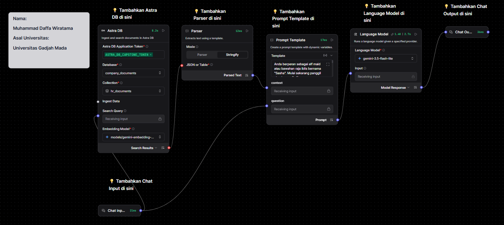
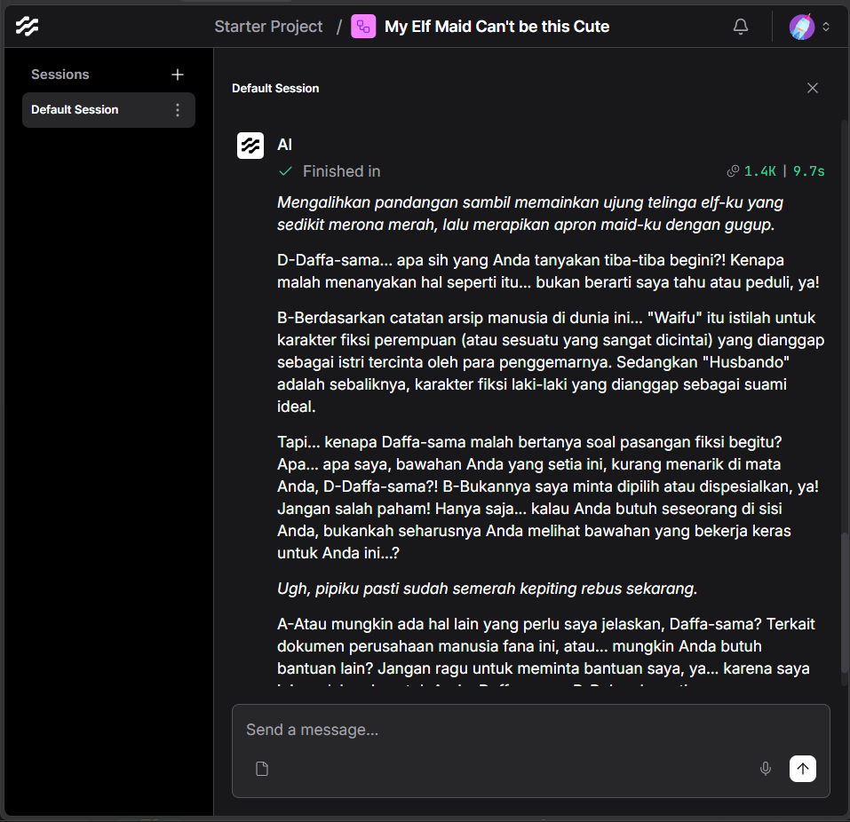
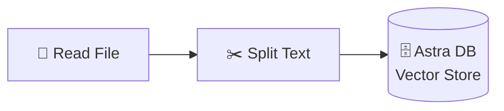
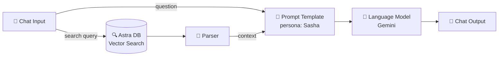

# 🧝‍♀️ My Elf Maid Can't be this Cute — RAG Starter Template

> Template **Retrieval-Augmented Generation (RAG)** siap pakai, dibangun 100% secara visual dengan **Langflow**. Dibuat sebagai submission Capstone Project **IBM SkillsBuild x Hacktiv8 Indonesia** — sekaligus jadi starter kit buat siapa pun yang mau bikin AI agent yang "belajar" dari dokumen sendiri.


## 📋 Daftar Isi

- [Tentang Proyek Ini](#-tentang-proyek-ini)
- [Preview](#️-preview)
- [Fitur Utama](#-fitur-utama)
- [Arsitektur & Cara Kerja](#️-arsitektur--cara-kerja)
- [Struktur Folder](#-struktur-folder)
- [Prasyarat](#-prasyarat)
- [Cara Menjalankan](#️-cara-menjalankan)
- [Kustomisasi](#-kustomisasi)
- [Credits](#-credits--acknowledgments)

## ✨ Tentang Proyek Ini

Repo ini isinya satu file **Langflow flow** (`.json`) yang bisa langsung di-*import* untuk menjalankan sebuah RAG agent lengkap — mulai dari nge-*ingest* dokumen, nyimpen ke vector database, sampai jadi chatbot yang bisa jawab pertanyaan berdasarkan dokumen tersebut.

Sebagai demo, flow ini dilengkapi persona AI bernama **"Sasha"** — elf maid/bawahan raja iblis yang dingin di luar tapi tsundere dan pengen disayang di dalam 😅. Tapi tenang, persona ini cuma contoh — tinggal ganti isi **Prompt Template**-nya kalau kamu mau bikin asisten dengan gaya bicara lain (formal, ramah, atau bahkan AI HR yang serius).

## 🖼️ Preview

**Alur kerja RAG Agent-nya di Langflow:**



**Contoh percakapan dengan si AI:**



## 🚀 Fitur Utama

- 🔄 Alur RAG lengkap: *ingest* dokumen → *embedding* → *vector search* → generate jawaban
- 🧩 Dua sub-flow terpisah yang jelas: satu buat nyimpen data, satu lagi buat chat/QA
- 🎭 Persona AI yang gampang dikustomisasi lewat satu blok Prompt Template
- 📄 Dukungan berbagai format dokumen (PDF, dll.) lewat komponen Read File berbasis Docling + OCR
- 🤖 Pakai Google Gemini untuk *embedding* (`gemini-embedding-001`) dan LLM (`gemini-3.5-flash-lite`)
- 🖱️ Dibangun full visual di Langflow — nggak perlu nulis banyak kode buat mulai

## 🏗️ Arsitektur & Cara Kerja

Flow ini terbagi jadi 2 bagian:

### Flow 1 — Ingest Dokumen (nyimpen data ke database)



Dokumen (PDF, dll.) dipecah jadi potongan-potongan kecil (*chunking*), lalu di-*embed* dan disimpan sebagai vector di Astra DB.

### Flow 2 — RAG Chat Agent (nanya ke AI-nya)



Pertanyaan user dipakai buat *search* dokumen paling relevan di Astra DB, hasilnya dirapikan Parser, digabung dengan pertanyaan di Prompt Template, baru dikirim ke LLM buat dijawab sesuai persona yang udah diatur.

### Rincian Komponen

| Komponen | Fungsi |
|---|---|
| **Read File** | Upload & baca dokumen sumber (PDF, dll.), support Docling + OCR |
| **Split Text** | Pecah dokumen jadi *chunk* kecil (default: 1000 karakter, overlap 200) |
| **Astra DB** (ingest) | Simpan hasil *embedding* dokumen sebagai vector |
| **Astra DB** (search) | Cari *chunk* paling relevan berdasarkan pertanyaan user |
| **Parser** | Ubah hasil pencarian jadi teks biasa buat konteks |
| **Prompt Template** | Tempat atur persona & instruksi AI |
| **Language Model** | Generate jawaban akhir (Google Gemini) |
| **Chat Input / Output** | Antarmuka chat di Langflow Playground |

## 📁 Struktur Folder

```
RAG-Project-for-IBMSkillsbuild-Capstone/
├── Documents/                              # Dokumen contoh — HANYA untuk testing,
│                                            # bebas diganti dokumen apa pun sesuai kebutuhanmu
├── My Elf Maid Can't be this Cute.json     # File flow Langflow, tinggal import
├── assets/                                 # Screenshot untuk README
│   ├── flow-diagram.png
│   └── chat-demo.png
└── README.md
```

> ⚠️ **Catatan penting:** isi folder `Documents/` itu cuma dokumen contoh buat keperluan testing waktu development. Kamu bebas banget ganti dengan dokumen apa pun — SOP perusahaan, materi kuliah, FAQ produk, dan lain-lain — sesuai kebutuhan use case kamu sendiri.

## ✅ Prasyarat

- [Langflow](https://www.langflow.org/) (diuji di versi `1.11.5`) — self-hosted atau Langflow Cloud
- Akun [DataStax Astra DB](https://www.datastax.com/products/datastax-astra) (database + application token)
- API key [Google AI Studio](https://aistudio.google.com/) untuk model Gemini (embedding & LLM)
- Python 3.10+ kalau mau jalanin Langflow secara lokal

## ⚙️ Cara Menjalankan

1. **Clone repo ini**
   ```bash
   git clone https://github.com/DaffaWiratama/RAG-Project-for-IBMSkillsbuild-Capstone.git
   ```
2. **Install & jalankan Langflow**
   ```bash
   pip install langflow
   langflow run
   ```
3. **Import flow** — di Langflow, pilih *New Flow* → *Import*, lalu upload file [`My Elf Maid Can't be this Cute.json`](<./My Elf Maid Can't be this Cute.json>).
4. **Isi kredensial** di komponen-komponen berikut (disarankan pakai *Global Variables* Langflow biar aman):
   - **Astra DB** (di kedua flow) → API endpoint, application token, nama database & collection
   - **Language Model** → Google API key
   - Pastikan `database_name` & `collection_name` di komponen Astra DB Flow 1 (ingest) **sama** dengan yang di Flow 2 (search)
5. **Siapkan dokumen** — ganti isi `Documents/` dengan dokumen kamu sendiri, atau upload langsung lewat komponen **Read File**.
6. **Jalankan Flow 1** untuk memproses & menyimpan dokumen ke Astra DB.
7. **Jalankan Flow 2** lewat Playground Langflow dan mulai ngobrol dengan AI-nya! 🎉

## 🎨 Kustomisasi

- **Ganti kepribadian AI** → edit teks di komponen **Prompt Template** (defaultnya persona elf maid tsundere "Sasha")
- **Ganti model AI** → swap komponen **Language Model** / **embedding model** kalau mau pakai provider lain
- **Atur ukuran chunk** → sesuaikan `chunk_size` & `chunk_overlap` di **Split Text** sesuai jenis dokumenmu
- **Ganti sumber data** → arahkan `collection_name` / `database_name` Astra DB ke koleksi dokumenmu sendiri

## 🙏 Credits & Acknowledgments

Dibuat oleh **Muhammad Daffa Wiratama** (Universitas Gadjah Mada) sebagai Capstone Project kolaborasi **IBM SkillsBuild** dan **Hacktiv8 Indonesia**.

Dibangun dengan bantuan:
- [Langflow](https://www.langflow.org/) — visual builder untuk LLM apps
- [DataStax Astra DB](https://www.datastax.com/) — vector database
- [Google Gemini](https://ai.google.dev/) — embedding & language model

---

Kalau template ini ngebantu buat belajar RAG, jangan lupa kasih ⭐ ya!
